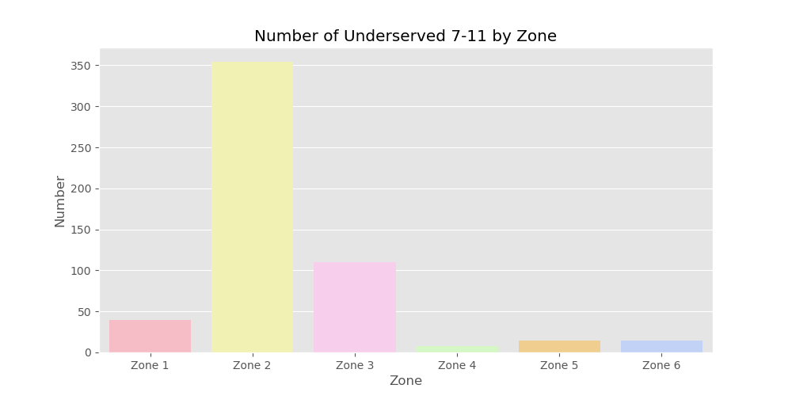

##  Project 2: Site Selection Analysis for 7-Eleven in Bangkok | README

---

### Introduction

Bangkok’s rapid urbanization, particularly along mass transit lines, has transformed consumer behavior and shopping preferences. As residents increasingly prioritize convenience and shorter commute times, there has been significant migration toward central Bangkok’s SkyTrain and subway corridors which caused the increasing number of condominiums around each station. In response to ongoing urbanization in Bangkok, players in the modern trade industry, especially convenience stores, have been competing for market share within the segment. Nevertheless, competition is stiffening from other segments, in particular from discount stores which are opening smaller branches that are very similar to convenience stores. Examples of these include Big C Mini, Lotus’s go fresh and Top’s daily, these reduced-sized discount stores are now fighting over much the same customer base as convenience stores.Looking at the latest data on the amount of each major convenient stores outlets in ThailandThe market leader in this segment is 7-Eleven, which operates 72% of all convenience stores in Thailand. 7-Eleven is followed in importance by Lotus’s go fresh (10% of the market), Big C Mini (7%) and CJ More (5%).

---

### Problem Statement

While 7-Eleven maintains its position as Thailand’s largest retail chain, several underserved areas remain in this evolving urban landscape. This presents both an opportunity and challenge: how can 7-Eleven strategically expand its footprint to capture these underserved markets before competitors, while maintaining its competitive advantage in convenience retail ?

---

### Procedures

- Categorized Bangkok districts into zones based on land use criteria from the Department of City Planning and Urban Development of Bangkok Metropolitan.
- Mapped 7-Eleven branches and housing data, focusing on condominium properties in each Bangkok zone.
- Analyze the number of 7-Eleven branches near condominiums to identify underserved areas.

---
### Data Dictionary

Column details are [here](data_dictionary.md).

---
### Finding

Using our housing dataset and 7-Eleven store locations, our model generated the following output:

---
### Conclusion

#### Recommendation

- Opening new branches according to the research and model.
- Take a onsite survey to find the available land for sale or rent
- Instead of opening new branches, having more new cashier and stocks can be considered.